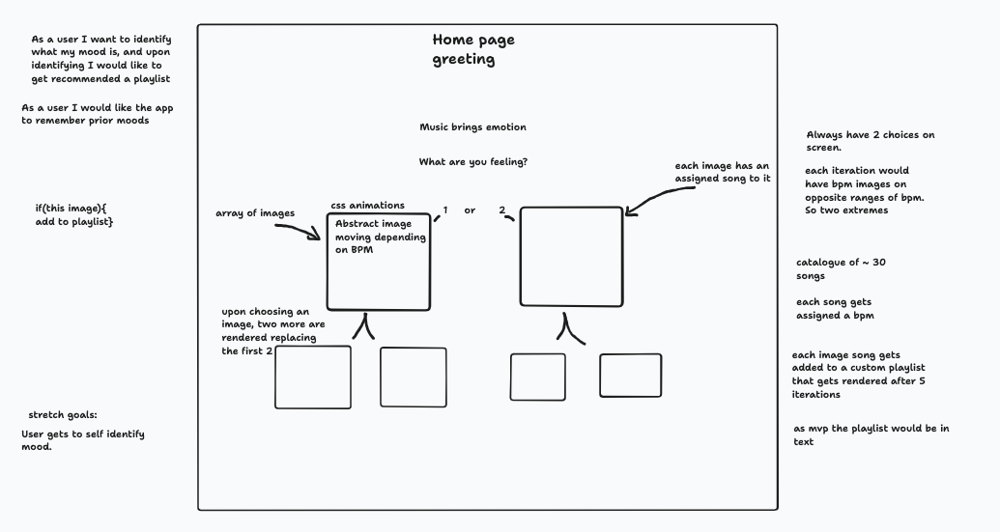
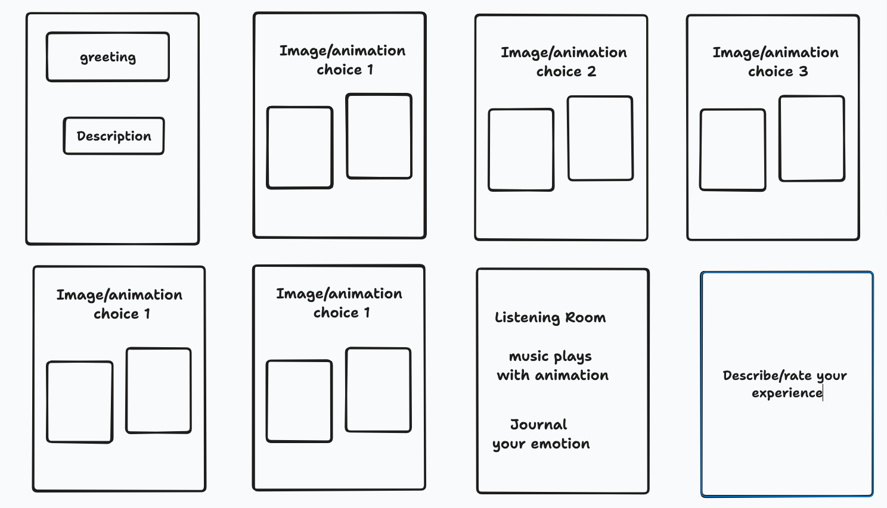

# listening-room

## DJ Code Jam
Users complete a visual questionnaire to determine their current vibe, and based on their responses, the app suggests and plays songs with corresponding beats per minute (BPM) range for their mood. For instance, if a user chooses a specific visual, the app suggests songs with a BPM range of 50-75 that match the vibe and pace of the image.

### Project Domain
This project addresses the challenge of finding music that aligns with a person's current mood. By creating an app that allows users to choose animations in their current mood, we recommend songs with suitable beats per minute (BPM) ranges, the application simplifies the process of curating personalized playlists. This solution aims to enhance the overall music discovery experience and provide users with a more enjoyable and emotionally resonant listening experience.

The domain model we are working on is a work in progress.

